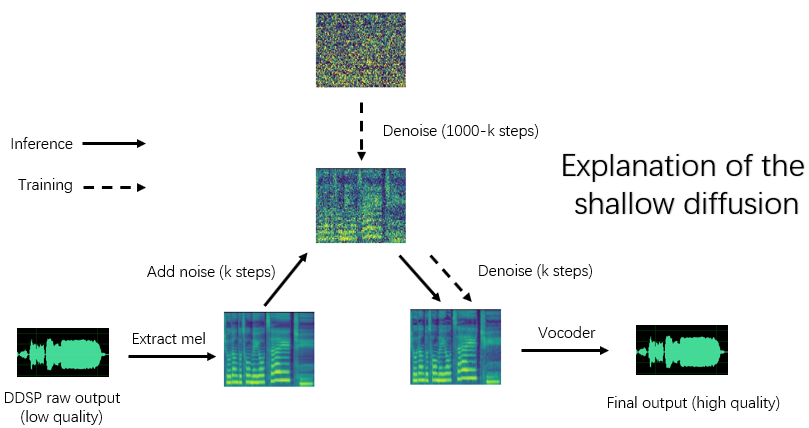

Language: [English] [简体中文](./cn_README.md) **한국어**
Translate into Korean by JS Park on 2024-06-11.

# DDSP-SVC

## (6.0 - 실험 단계) 새로운 정류 흐름 기반 모델

(1) 전처리(Preprocessing)：

```bash
python preprocess.py -c configs/reflow.yaml
```

(2) 훈련(Training)：

```bash
python train_reflow.py -c configs/reflow.yaml
```

(3) 비실시간 추론(Non-real-time inference)：

```bash
python main_reflow.py -i <input.wav> -m <model_ckpt.pt> -o <output.wav> -k <keychange (semitones)> -id <speaker_id> -step <infer_step> -method <method> -ts <t_start>
```
'infer_step'은 정류 흐름 ODE에 대한 샘플링 단계 수이고, 'method'는 'euler' 또는 'rk4'이며, 't_start'는 구성 파일에서의 `t_start`보다 크거나 같아야 하는 ODE의 시작 시점이므로 동일하게 유지하는 것이 좋습니다(기본값은 0.7).
'infer_step' is the number of sampling steps for rectified-flow ODE, 'method' is 'euler' or 'rk4', 't_start' is the start time point of ODE, which needs to be larger than or equal to `t_start` in the configuration file, it is recommended to keep it equal (the default is 0.7).

## (5.0 - 업데이트) 향상된 DDSP 캐스케이드 확산 모델

종속성 설치, 데이터 준비, 사전 훈련된 인코더(hubert 또는 contentvec), 피치 추출기(RMVPE) 및 보코더(nsf-hifigan) 구성은 순수 DDSP 모델을 훈련하는 것과 동일합니다(아래 섹션 참조).
Installing dependencies, data preparation, configuring the pre-trained encoder (hubert or contentvec), pitch extractor (RMVPE) and vocoder (nsf-hifigan) are the same as training a pure DDSP model (See section below).

릴리즈 페이지에서 사전 학습된 모델을 제공합니다.
We provide a pre-trained model in the release page.

`diffusion-fast.yaml`의 'expdir' 매개변수로 지정된 모델 내보내기 폴더로 `model_0.pt`를 이동하면, 해당 폴더에 사전 훈련된 모델을 프로그램이 자동으로 불러올 것입니다.
Move the `model_0.pt` to the model export folder specified by the 'expdir' parameter in `diffusion-fast.yaml`, and the program will automatically load the pre-trained model in that folder.

(1) 전처리(Preprocessing)：

```bash
python preprocess.py -c configs/diffusion-fast.yaml
```

(2) 캐스케이드 모델(하나의 모델만) 훈련(Train a cascade model; only train one model)：

```bash
python train_diff.py -c configs/diffusion-fast.yaml
```

(3) 비실시간 추론(Non-real-time inference)：

```bash
python main_diff.py -i <input.wav> -diff <diff_ckpt.pt> -o <output.wav> -k <keychange (semitones)> -id <speaker_id> -speedup <speedup> -method <method> -kstep <kstep>
```

5.0 버전 모델에는 DDSP 모델이 내장되어 있으므로 `-ddsp`를 사용하여 외부 DDSP 모델을 지정할 필요가 없습니다. 다른 옵션은 3.0 버전 모델과 같은 의미지만, 'kstep'은 구성 파일에서의 `k_step_max`보다 작거나 같아야 하므로 동일하게 유지하는 것이 좋습니다(기본값은 100).
The 5.0 version model has a built-in DDSP model, so specifying an external DDSP model using `-ddsp` is unnecessary. The other options have the same meaning as the 3.0 version model, but 'kstep' needs to be less than or equal to `k_step_max` in the configuration file, it is recommended to keep it equal (the default is 100)

(4) 실시간 GUI(Real-time GUI)：

```bash
python gui_diff.py
```

참고: GUI 우측에 버전 5.0 모델을 로드해야 합니다.
Note: You need to load the version 5.0 model on the right hand side of the GUI.

## (4.0 - 업데이트) 새로운 DDSP 캐스케이드 확산 모델

사전 학습된 모델은 여기에서 제공합니다: <https://huggingface.co/datasets/ms903/DDSP-SVC-4.0/resolve/main/pre-trained-model/model_0.pt> ('contentvec768l12' 인코더 사용)

위 5.0 버전이 4.0 버전에 대해 완전한 상위 호환이므로 4.0 버전에 대한 안내는 별도로 제공하지 않습니다.
4.0 버전을 사용하고자 한다면 5.0 버전의 안내를 참고하되, `diffusion-fast.yaml`을 `diffusion-new.yaml`로 대체하십시오.

참고: GUI 우측에 버전 4.0 모델을 로드해야 합니다.
Note: You need to load the version 4.0 model on the right hand side of the GUI.

## (3.0 - 업데이트) 얕은 확산 모델(DDSP + Diff-SVC refactor 버전)



종속성 설치, 데이터 준비, 사전 학습된 인코더(hubert 또는 contentvec), 피치 추출기(RMVPE) 및 보코더(nsf-hifigan) 구성은 순수 DDSP 모델을 학습시키는 것과 동일합니다(아래 1장에서 3장까지 참조).
Installing dependencies, data preparation, configuring the pre-trained encoder (hubert or contentvec), pitch extractor (RMVPE) and vocoder (nsf-hifigan) are the same as training a pure DDSP model (See chapter 1 \~ 3 below).

확산 모델은 훈련시키기 더 어렵기에 사전 학습된 모델을 몇 가지 제공합니다:
Because the diffusion model is more difficult to train, we provide some pre-trained models here:

<https://huggingface.co/datasets/ms903/Diff-SVC-refactor-pre-trained-model/blob/main/hubertsoft_fix_pitch_add_vctk_500k/model_0.pt> (using 'hubertsoft' encoder)

<https://huggingface.co/datasets/ms903/Diff-SVC-refactor-pre-trained-model/blob/main/fix_pitch_add_vctk_600k/model_0.pt> (using 'contentvec768l12' encoder)

`diffusion.yaml`의 'expdir' 매개변수로 지정된 모델 내보내기 폴더로 `model_0.pt`를 이동하면, 해당 폴더에 사전 훈련된 모델을 프로그램이 자동으로 불러올 것입니다.
Move the `model_0.pt` to the model export folder specified by the 'expdir' parameter in `diffusion.yaml`, and the program will automatically load the pre-trained models in that folder.

(1) 전처리(Preprocessing)：

```bash
python preprocess.py -c configs/diffusion.yaml
```

This preprocessing can also be used to train the DDSP model without preprocessing twice, but you need to ensure that the parameters under the 'data' tag in yaml files are consistent.

(2) 확산 모델 훈련(Train a diffusion model)：

```bash
python train_diff.py -c configs/diffusion.yaml
```

(3) DDSP 모델 학습(Train a DDSP model)：

```bash
python train.py -c configs/combsub.yaml
```

위에서 언급했듯이 재전처리(re-preprocessing)는 필요하지 않지만, `combsub.yaml`과 `diffusion.yaml`의 매개변수가 일치하는지 확인하시기 바랍니다. 화자 수 'n_spk'는 일관성이 없을 수 있지만 동일한 화자를 나타내기 위해 동일한 ID를 사용하십시오(이렇게 하면 추론이 더 쉬워집니다).
As mentioned above, re-preprocessing is not required, but please check whether the parameters of `combsub.yaml` and `diffusion.yaml` match. The number of speakers 'n_spk' can be inconsistent, but try to use the same id to represent the same speaker (this makes inference easier).

(4) 비실시간 추론(Non-real-time inference)：

```bash
python main_diff.py -i <input.wav> -ddsp <ddsp_ckpt.pt> -diff <diff_ckpt.pt> -o <output.wav> -k <keychange (semitones)> -id <speaker_id> -diffid <diffusion_speaker_id> -speedup <speedup> -method <method> -kstep <kstep>
```
'speedup'은 가속 속도이고, 'method'는 'ddim', 'pndm', 'dpm-solver' 또는 'unipc'이며, 'kstep'은 얕은 확산 단계 수를, 'diffid'는 확산 모델의 화자(speaker) ID를 의미합니다. 그 외의 매개변수들은 `main.py`와 동일한 의미를 갖습니다.
'speedup' is the acceleration speed, 'method' is 'ddim', 'pndm', 'dpm-solver' or 'unipc', 'kstep' is the number of shallow diffusion steps, 'diffid' is the speaker id of the diffusion model, and other parameters have the same meaning as `main.py`.

합리적인 'kstep'은 약 100에서 300입니다. 'speedup'이 20을 초과하면 음질이 손실될 수 있습니다.
A reasonable 'kstep' is about 100\~300. There may be a perceived loss of sound quality when 'speedup' exceeds 20.

훈련 중 동일한 화자를 나타내는 데 동일한 ID가 사용된 경우 '-diffid'는 비워둘 수 있으며, 그렇지 않다면 '-diffid' 옵션을 지정해야 합니다.
If the same id has been used to represent the same speaker during training, '-diffid' can be empty, otherwise the '-diffid' option needs to be specified.

만약 '-ddsp'가 비어 있으면 순수 확산 모델을 사용하며, 이때 입력 소스의 mel로 얕은 확산을 수행하고, '-kstep'이 비어 있게 될 때 완전한 가우시안 확산을 수행합니다.
If '-ddsp' is empty, the pure diffusion model is used, at this time, shallow diffusion is performed with the mel of the input source, and if further '-kstep' is empty, full-depth Gaussian diffusion is performed.

프로그램은 DDSP 모델과 확산 모델의 매개변수들이 일치하는지(샘플링 속도, hop 크기 및 인코더)를 자동으로 확인하고, 만약 일치하지 않을 경우 DDSP 모델 로드를 무시하고 가우시안 확산 모드로 들어갑니다.
The program will automatically check whether the parameters of the DDSP model and the diffusion model match (sampling rate, hop size and encoder), and if they do not match, it will ignore loading the DDSP model and enter Gaussian diffusion mode.

(5) 실시간 GUI(Real-time GUI)：

```bash
python gui_diff.py
```

## 0. 소개

DDSP-SVC는 개인용 컴퓨터에서 대중화할 수 있는 무료 AI voice changer 소프트웨어 개발에 전념하는 새로운 오픈 소스 노래 음성 변환 프로젝트입니다.
DDSP-SVC is a new open source singing voice conversion project dedicated to the development of free AI voice changer software that can be popularized on personal computers.

유명한 [SO-VITS-SVC](https://github.com/svc-develop-team/so-vits-svc)와 비교 시 훈련 및 합성은 컴퓨터 하드웨어에 대한 요구 사항이 낮으며 학습 시간은 [RVC](https://github.com/RVC-Project/Retrieval-based-Voice-Conversion-WebUI)의 학습 속도에 가깝게 단축될 수 있습니다.
Compared with the famous [SO-VITS-SVC](https://github.com/svc-develop-team/so-vits-svc), its training and synthesis have much lower requirements for computer hardware, and the training time can be shortened by orders of magnitude, which is close to the training speed of [RVC](https://github.com/RVC-Project/Retrieval-based-Voice-Conversion-WebUI).

또한, 실시간 음성 변경을 수행할 때 이 프로젝트의 하드웨어 리소스 소비는 SO-VITS-SVC보다 훨씬 낮지만 최신 버전의 RVC보다는 약간 높을 수 있습니다.
In addition, when performing real-time voice changing, the hardware resource consumption of this project is significantly lower than that of SO-VITS-SVC，but probably slightly higher than the latest version of RVC.

비록 기존 DDSP의 합성 품질은 이상적이지 않지만(기존 출력은 훈련 중에 텐서보드에서 들을 수 있음), 사전 훈련된 보코더 기반 인핸서(구 버전) 또는 얕은 확산 모델(신 버전)로 음질을 향상시킨 후에는 일부 데이터셋에서 SO-VITS-SVC 및 RVC 이상의 합성 품질을 달성할 수 있습니다.
Although the original synthesis quality of DDSP is not ideal (the original output can be heard in tensorboard while training), after enhancing the sound quality with a pre-trained vocoder based enhancer (old version) or with a shallow diffusion model (new version), for some datasets, it can achieve the synthesis quality no less than SO-VITS-SVC and RVC.

구 버전 모델은 여전히 호환되며, 다음 장부터는 구 버전에 대한 지침입니다. 신 버전의 일부 작업은 이와 동일합니다(이전 장 참조).
The old version models are still compatible, the following chapters are the instructions for the old version. Some operations of the new version are the same, see the previous chapters.

면책 조항: **합법적으로 획득한 승인된 데이터**로만 DDSP-SVC 모델을 훈련하고, 이러한 모델과 합성한 오디오를 불법적인 목적으로 사용하지 마십시오. 본 모델 체크포인트 및 오디오의 사용으로 인해 발생하는 침해, 사기 및 기타 불법 행위에 대해서 책임을 지지 않습니다.
Disclaimer: Please make sure to only train DDSP-SVC models with **legally obtained authorized data**, and do not use these models and any audio they synthesize for illegal purposes. The author of this repository is not responsible for any infringement, fraud and other illegal acts caused by the use of these model checkpoints and audio.

## 1. 종속성 설치

먼저 [공식 웹 사이트](https://pytorch.org/)에서 PyTorch를 설치하고, 다음을 실행하세요:
We recommend first installing PyTorch from the [official website](https://pytorch.org/), then run:

```bash
pip install -r requirements.txt
```
참고: Python 3.8 (Windows) + torch 1.9.1 + torchaudio 0.6.0을 사용하여 테스트했으며, 너무 새롭거나 오래된 종속성은 작동하지 않을 수 있습니다.
NOTE: I only test the code using Python 3.8 (Windows) + torch 1.9.1 + torchaudio 0.6.0, too new or too old dependencies may not work.

업데이트: Python 3.8 (Windows) + cuda 11.8 + torch 2.0.0 + torchaudio 2.0.1도 작동하며, 훈련이 더 빠른 것을 확인했습니다.
UPDATE: Python 3.8 (Windows) + cuda 11.8 + torch 2.0.0 + torchaudio 2.0.1 works, and training is faster.

## 2. 사전 학습된 모델 구성

- 기능 인코더 (하나만 선택):
- Feature Encoder (choose only one):

(1) 사전 학습된 [ContentVec](https://ibm.ent.box.com/s/z1wgl1stco8ffooyatzdwsqn2psd9lrr) 인코더를 다운로드하여 `pretrain/contentvec` 폴더 아래에 넣습니다.
(1) Download the pre-trained [ContentVec](https://ibm.ent.box.com/s/z1wgl1stco8ffooyatzdwsqn2psd9lrr) encoder and put it under `pretrain/contentvec` folder.

(2) 사전 학습된 [HubertSoft](https://github.com/bshall/hubert/releases/download/v0.1/hubert-soft-0d54a1f4.pt) 인코더를 다운로드하여 `pretrain/hubert` 폴더 아래에 넣은 후, 구성 파일을 동시에 수정합니다.
(2) Download the pre-trained [HubertSoft](https://github.com/bshall/hubert/releases/download/v0.1/hubert-soft-0d54a1f4.pt) encoder and put it under `pretrain/hubert` folder, and then modify the configuration file at the same time.

- 보코더 또는 인핸서:
- Vocoder or enhancer:

사전 훈련된 [NSF-HiFiGAN](https://github.com/openvpi/vocoders/releases/download/nsf-hifigan-44.1k-hop512-128bin-2024.02/nsf_hifigan_44.1k_hop512_128bin_2024.02.zip) 보코더를 다운로드하고 압축을 풉니다.
Download and unzip the pre-trained [NSF-HiFiGAN](https://github.com/openvpi/vocoders/releases/download/nsf-hifigan-44.1k-hop512-128bin-2024.02/nsf_hifigan_44.1k_hop512_128bin_2024.02.zip) vocoder,

또는 https://github.com/openvpi/SingingVocoders 프로젝트를 이용하여 더 높은 음질을 위해 보코더를 미세 조정할 수도 있습니다.
or use the https://github.com/openvpi/SingingVocoders project to fine-tune the vocoder for higher sound quality.

그런 다음 체크포인트 파일의 이름을 바꾸고 구성 파일의 'vocoder.ckpt' 매개변수로 지정된 위치(기본값: `pretrain/nsf_hifigan/model`)에 배치합니다.
Then rename the checkpoint file and place it at the location specified by the 'vocoder.ckpt' parameter in the configuration file. The default value is `pretrain/nsf_hifigan/model`.

보코더의 'config.json'는 동일한 디렉토리에 있어야 합니다(예: `pretrain/nsf_hifigan/config.json`).
The 'config.json' of the vocoder needs to be at the same directory, for example, `pretrain/nsf_hifigan/config.json`.

- 피치 추출기:
- Pitch extractor:

사전 훈련된 [RMVPE](https://github.com/yxlllc/RMVPE/releases/download/230917/rmvpe.zip) 추출기를 다운로드하고 `pretrain/` 폴더에 압축을 풉니다.
Download the pre-trained [RMVPE](https://github.com/yxlllc/RMVPE/releases/download/230917/rmvpe.zip) extractor and unzip it into `pretrain/` folder.

## 3. 전처리

훈련 데이터셋(.wav 형식 오디오 클립) 전체를 `data/train/audio`에 넣습니다. 검증 데이터셋(.wav 형식 오디오 클립) 전체를 `data/val/audio`에 넣습니다. 다음을 실행할 수도 있습니다:
Put all the training dataset (.wav format audio clips) in the below directory: `data/train/audio`. Put all the validation dataset (.wav format audio clips) in the below directory: `data/val/audio`. You can also run:

```bash
python draw.py
```

유효성 검증 데이터를 선택하는 데 도움이 됩니다. (`draw.py`의 매개변수를 조정하여 추출된 파일 수와 기타 매개변수를 수정할 수 있습니다.)
to help you select validation data (you can adjust the parameters in `draw.py` to modify the number of extracted files and other parameters)

그런 다음 combtooth substractive synthesiser 모델 실행 (**권장**):
Then run for a model of combtooth substractive synthesiser (**recommend**):

```bash
python preprocess.py -c configs/combsub.yaml
```

또는 sinusoids additive synthesiser 모델 실행:
or run for a model of sinusoids additive synthesiser:

```bash
python preprocess.py -c configs/sins.yaml
```

확산 모델 훈련에 대한 자세한 내용은 상단의 섹션 3.0, 4.0 또는 5.0을 참조하세요.
For training the diffusion model, see section 3.0, 4.0 or 5.0 above.

전처리 전에 구성 파일 `config/<model_name>.yaml`을 수정할 수 있습니다. 기본 구성은 GTX 1660 그래픽 카드를 사용하여 44.1khz high sampling rate synthesiser를 훈련시키는 데 맞춰져 있습니다.
You can modify the configuration file `config/<model_name>.yaml` before preprocessing. The default configuration is suitable for training 44.1khz high sampling rate synthesiser with GTX 1660 graphics card.

참고 1: 모든 오디오 클립의 샘플링 속도를 yaml 구성 파일의 샘플링 속도와 일관되게 유지하십시오! 일관성이 없어도 프로그램 실행은 가능하지만 훈련 과정 중 리샘플링이 매우 느립니다.
NOTE 1: Please keep the sampling rate of all audio clips consistent with the sampling rate in the yaml configuration file! If it is not consistent, the program can be executed safely, but the resampling during the training process will be very slow.

참고 2: 훈련 데이터셋에 대한 오디오 클립의 총 수는 약 1000개로 권장되며, 특히 긴 오디오 클립은 짧은 세그먼트로 잘라 훈련 속도를 높일 수 있지만 모든 오디오 클립의 지속 시간은 2초 이상이어야 합니다. 오디오 클립이 너무 많으면 큰 내부 메모리가 필요하거나 구성 파일에서 'cache_all_data' 옵션을 false로 설정해야 합니다.
NOTE 2: The total number of the audio clips for training dataset is recommended to be about 1000, especially long audio clip can be cut into short segments, which will speed up the training, but the duration of all audio clips should not be less than 2 seconds. If there are too many audio clips, you need a large internal-memory or set the 'cache_all_data' option to false in the configuration file.

참고 3: 유효성 검증 데이터셋을 위한 오디오 클립의 총 수는 약 10개로 권장되며, 너무 많이 넣으면 유효성 검증 수행이 매우 느려질 수 있습니다.
NOTE 3: The total number of the audio clips for validation dataset is recommended to be about 10, please don't put too many or it will be very slow to do the validation.

참고 4: 만약 사용할 데이터셋의 품질이 좋지 않다면, 설정 파일에서 'f0_extractor'를 'rmvpe'로 설정하십시오.
NOTE 4: If your dataset is not very high quality, set 'f0_extractor' to 'rmvpe' in the config file.

참고 5: 다중 화자(speaker) 훈련이 현재 지원됩니다. 구성 파일의 'n_spk' 매개변수는 다중 화자 모델 여부를 제어합니다. **다중 화자** 모델을 훈련시키려면 화자 ID를 나타내기 위해 오디오 폴더의 이름을 **'n_spk'보다 크지 않은 양의 정수**로 지정해야 하며, 디렉토리 구조는 다음과 같습니다:
NOTE 5: Multi-speaker training is supported now. The 'n_spk' parameter in configuration file controls whether it is a multi-speaker model. If you want to train a **multi-speaker** model, audio folders need to be named with **positive integers not greater than 'n_spk'** to represent speaker ids, the directory structure is like below:

```bash
# training dataset
# the 1st speaker
data/train/audio/1/aaa.wav
data/train/audio/1/bbb.wav
...
# the 2nd speaker
data/train/audio/2/ccc.wav
data/train/audio/2/ddd.wav
...

# validation dataset
# the 1st speaker
data/val/audio/1/eee.wav
data/val/audio/1/fff.wav
...
# the 2nd speaker
data/val/audio/2/ggg.wav
data/val/audio/2/hhh.wav
...
```

'n_spk' \= 1인 경우 **단일 화자** 모델의 디렉토리 구조는 여전히 지원되며, 다음과 같습니다:
If 'n_spk' \= 1, The directory structure of the **single speaker** model is still supported, which is like below:

```bash
# training dataset
data/train/audio/aaa.wav
data/train/audio/bbb.wav
...
# validation dataset
data/val/audio/ccc.wav
data/val/audio/ddd.wav
...
```

## 4. 훈련

```bash
# train a combsub model as an example
python train.py -c configs/combsub.yaml
```

다른 모델을 학습시키기 위한 명령줄도 비슷합니다.
The command line for training other models is similar.

훈련을 안전하게 중단한 다음 동일한 명령줄을 실행하면 훈련이 다시 시작됩니다.
You can safely interrupt training, then running the same command line will resume training.

먼저 훈련을 중단한 다음 새 데이터셋을 다시 전처리하거나 훈련 매개 변수(batchsize, lr 등)를 변경한 다음 동일한 명령줄을 실행하는 경우 모델을 미세 조정할 수도 있습니다.
You can also finetune the model if you interrupt training first, then re-preprocess the new dataset or change the training parameters (batchsize, lr etc.) and then run the same command line.

## 5. 시각화

```bash
# check the training status using tensorboard
tensorboard --logdir=exp
```

테스트 오디오 샘플은 첫 번째 검증 후 TensorBoard에 표시됩니다.
Test audio samples will be visible in TensorBoard after the first validation.

참고: Tensorboard의 테스트 오디오 샘플은 인핸서에 의해 향상되지 않은 DDSP-SVC 모델의 원본 출력입니다. 인핸서(품질이 더 높을 수 있음)를 사용한 후 합성 효과를 테스트하려면 다음 장에 설명된 방법을 사용하십시오.
NOTE: The test audio samples in Tensorboard are the original outputs of your DDSP-SVC model that is not enhanced by an enhancer. If you want to test the synthetic effect after using the enhancer (which may have higher quality), please use the method described in the following chapter.

## 6. 비실시간 VC

(**추천**) 사전 훈련된 보코더 기반 인핸서를 사용하여 출력을 향상시킵니다:
(**Recommend**) Enhance the output using the pretrained vocoder-based enhancer:

```bash
# high audio quality in the normal vocal range if enhancer_adaptive_key = 0 (default)
# set enhancer_adaptive_key > 0 to adapt the enhancer to a higher vocal range
python main.py -i <input.wav> -m <model_file.pt> -o <output.wav> -k <keychange (semitones)> -id <speaker_id> -eak <enhancer_adaptive_key (semitones)>
```

DDSP의 원본 출력:
Raw output of DDSP:

```bash
# fast, but relatively low audio quality (like you hear in tensorboard)
python main.py -i <input.wav> -m <model_file.pt> -o <output.wav> -k <keychange (semitones)> -id <speaker_id> -e false
```

f0 추출기 및 response threhold에 대한 다른 옵션에 대해서는 다음을 참조:
Other options about the f0 extractor and response threhold，see:

```bash
python main.py -h
```

(업데이트) 이제 Mix-speaker가 지원됩니다. "-mix" 옵션을 사용하여 자신만의 보컬 음색을 디자인할 수 있습니다. 아래는 예시:
(UPDATE) Mix-speaker is supported now. You can use "-mix" option to design your own vocal timbre, below is an example:

```bash
# Mix the timbre of 1st and 2nd speaker in a 0.5 to 0.5 ratio
python main.py -i <input.wav> -m <model_file.pt> -o <output.wav> -k <keychange (semitones)> -mix "{1:0.5, 2:0.5}" -eak 0
```

## 7. 실시간 VC

다음 명령을 통해 간단한 GUI 시작:
Start a simple GUI with the following command:

```bash
python gui.py
```

프론트 엔드는 슬라이딩 윈도우, 크로스 페이딩, SOLA 기반 splicing 및 contextual semantic reference와 같은 기술을 사용하여 낮은 대기 시간과 리소스 점유로 비실시간 합성에 가까운 음질을 얻을 수 있습니다.
The front-end uses technologies such as sliding window, cross-fading, SOLA-based splicing and contextual semantic reference, which can achieve sound quality close to non-real-time synthesis with low latency and resource occupation.

업데이트: 위상(phase) 보코더를 기반으로 한 접합 알고리즘이 추가되었지만, 대부분의 경우 SOLA 알고리즘이 이미 충분히 높은 접합 음질을 갖고 있으므로 기본적으로 꺼져 있습니다. 극도로 저지연 실시간 음질을 추구하는 경우 해당 옵션을 켜고 파라미터를 신중하게 튜닝하는 것을 고려할 수 있으며, 음질이 높아질 가능성이 있습니다. 그러나 많은 테스트에서 크로스 페이드 시간이 0.1초보다 길면 위상 보코더가 음질을 크게 저하시키는 것으로 나타났습니다.
Update: A splicing algorithm based on a phase vocoder is now added, but in most cases the SOLA algorithm already has high enough splicing sound quality, so it is turned off by default. If you are pursuing extreme low-latency real-time sound quality, you can consider turning it on and tuning the parameters carefully, and there is a possibility that the sound quality will be higher. However, a large number of tests have found that if the cross-fade time is longer than 0.1 seconds, the phase vocoder will cause a significant degradation in sound quality.

## 8. 감사의 글

- [DDSP](https://github.com/magenta/ddsp)

- [PC-DDSP](https://github.com/yxlllc/pc-ddsp)

- [Soft-VC](https://github.com/bshall/soft-vc)

- [ContentVec](https://github.com/auspicious3000/contentvec)

- [DiffSinger (OpenVPI version)](https://github.com/openvpi/DiffSinger)

- [Diff-SVC](https://github.com/prophesier/diff-svc)

- [Diffusion-SVC](https://github.com/CNChTu/Diffusion-SVC)
